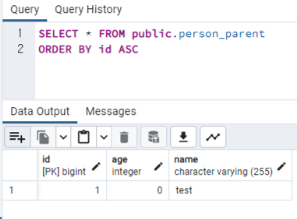
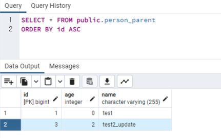

## @Transactional의 propagation
***
**propagation** : 전파 속성

* REQUIRED
    *  기본값으로, 해당 메서드를 호출한 곳에서 별도의 트랜잭션이 설정되어 있지 않았다면 트랜잭션를 새로 시작한다. (새로운 연결을 생성하고 실행됨.)
    *  만약, 호출한 곳에서 이미 트랜잭션이 설정되어 있다면 기존의 트랜잭션 내에서 로직을 실행한다. (동일한 연결 안에서 실행됨.) 그리고 <u>예외가 발생하면 롤백이 되고 호출한 곳에도 롤백이 전파된다.</u>
    
* REQUIRED_NEW
    * 매번 새로운 트랜잭션을 시작한다. (새로운 연결을 생성하고 실행함.) 
    * 만약, 호출한 곳에서 이미 트랜잭션이 설정되어 있다면(기존의 연결이 존재한다면) 기존의 트랜잭션은 메서드가 종료할 때까지 잠시 대기 상태로 두고 자신의 트랜잭션을 실행한다. <u>새로운 트랜잭션 안에서 예외가 발생해도 호출한 곳에는 롤백이 전파되지 않는다.</u> 
    * **즉, 2개의 트랜잭션은 완전히 독립적인 별개로 단위로 작동한다.**
    

이론 출처 : https://jsonobject.tistory.com/467

***
### REQUIRED 결과
##### 자식에서 unexpected exception 발생 시, 부모도 rollback 된다.

```Hibernate: 
    insert 
    into
        person_parent
        (age, name) 
    values
        (?, ?)
Hibernate: 
    select
        person_par0_.id as id1_0_0_,
        person_par0_.age as age2_0_0_,
        person_par0_.name as name3_0_0_ 
    from
        person_parent person_par0_ 
    where
        person_par0_.id=?
Hibernate: 
    insert 
    into
        person_log_child
        (now, person_id) 
    values
        (?, ?)
2023-12-05 10:02:17.883 ERROR 14160 --- [    Test worker] c.e.transactional.service.PersonService  : unexpected exception 발생

Transaction silently rolled back because it has been marked as rollback-only
org.springframework.transaction.UnexpectedRollbackException: Transaction silently rolled back because it has been marked as rollback-only
	at org.springframework.transaction.support.AbstractPlatformTransactionManager.processCommit(AbstractPlatformTransactionManager.java:752)
	at org.springframework.transaction.support.AbstractPlatformTransactionManager.commit(AbstractPlatformTransactionManager.java:711)
```
<br/>

### REQUIRED_NEW 결과
##### 자식에서 unexpected exception 발생 시, 부모는 rollback 되지 않는다.


```
Hibernate: 
    insert 
    into
        person_parent
        (age, name) 
    values
        (?, ?)
Hibernate: 
    select
        person_par0_.id as id1_0_0_,
        person_par0_.age as age2_0_0_,
        person_par0_.name as name3_0_0_ 
    from
        person_parent person_par0_ 
    where
        person_par0_.id=?
Hibernate: 
    insert 
    into
        person_log_child
        (now, person_id) 
    values
        (?, ?)
2023-12-05 10:05:21.517 ERROR 24020 --- [    Test worker] c.e.transactional.service.PersonService  : unexpected exception 발생
Hibernate: 
    update
        person_parent 
    set
        age=?,
        name=? 
    where
        id=?
```